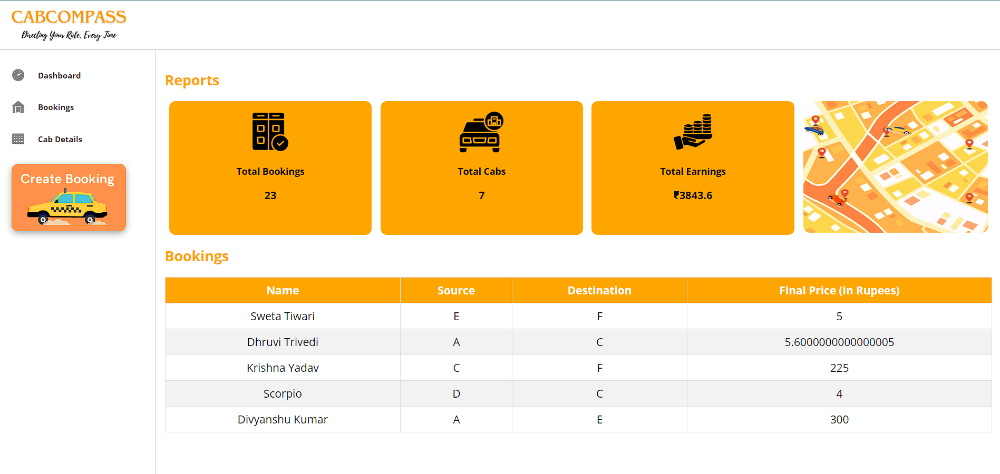
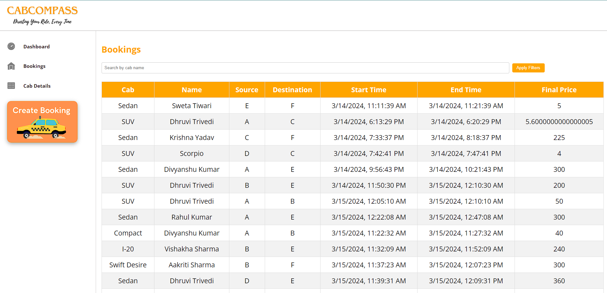
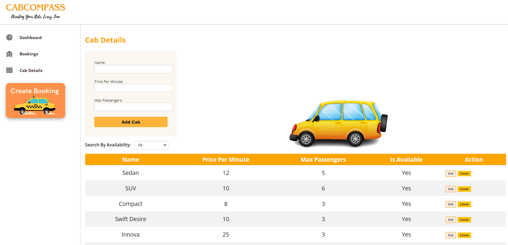
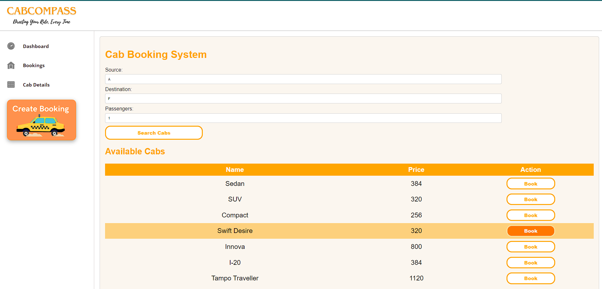
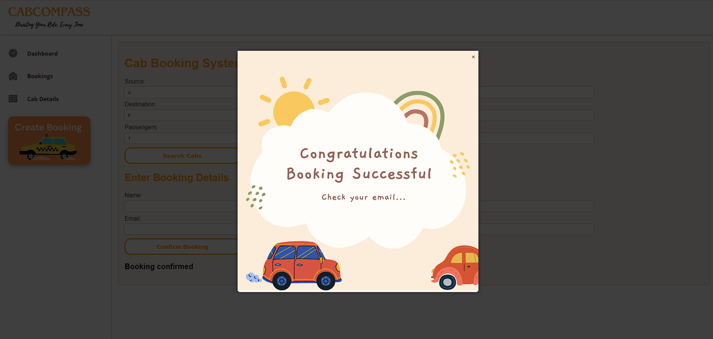
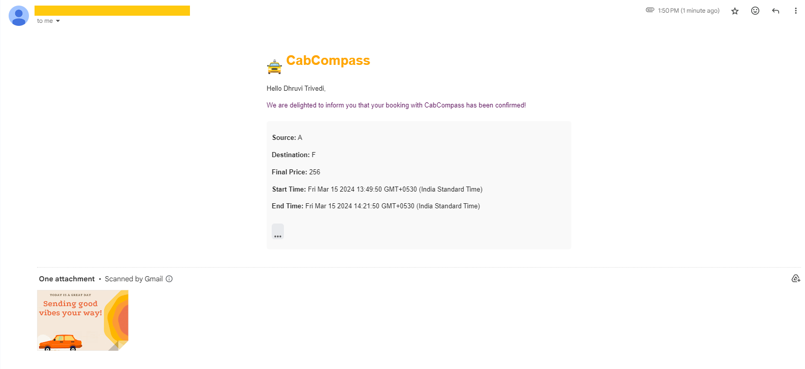

# CabCompass - Your Smart Cab Booking Solution 🚖

Welcome to CabCompass, a smart cab booking solution designed to make your travel experience seamless and convenient.

CabCompass is a web application built with the MERN stack (MongoDB, Express.js, React.js, Node.js) that allows users to book cabs for their travel needs. The application utilizes a graph-based algorithm to calculate the shortest path and duration between source and destination locations, providing users with accurate fare estimates and available cab options.

## Key Features
* Seamless cab booking process
* Real-time fare estimation
* Intelligent routing algorithm
* User-friendly interface

## Table of Contents
1. Installation
2. Usage
3. Live View
4. Screenshot
5. Credit
6. License

## Installation
To run the CabCompass project locally, follow these steps:

* Clone the repository to your local machine:
```bash
git clone https://github.com/602dhruviii/cabcompass.git
```
* Navigate to the project directory:
```bash
cd cabcompass
```
* Install dependencies for the backend (Node.js and Express.js):
```bash
npm install
```
* Install dependencies for the frontend (React.js):
```bash
cd client
npm install
```
* Create a .env file in the root directory.
* Add the following environment variables:

```.env
PORT=5000
MONGODB_URI=your_mongodb_connection_string
```
* Start the backend server:
```bash
node server.js
```
* Start the frontend development server:
```bash
npm start
```
## How to Use the Project
* Visit the CabCompass web application in your browser.
* Enter your source and destination locations.
* Select the number of passengers 
* View available cab options, fares, and estimated travel time.
* Choose a cab and confirm your booking.
Receive a booking confirmation email with trip details.

## Live View
- ***[CabCompass](https://awesomeopensource.com/project/elangosundar/awesome-README-templates)***


## Screenshots and Visual Aids
### Dashboard View


### Booking History View


### Cab Details View


### Create Booking View


### Booking Confirmation


### Booking Email Successful



## Credits
* **Project Lead**: *[Dhruvi Trivedi](https://github.com/602dhruviii)*
* **References**: 
  * React.js Documentation
  * Express.js Documentation
  * MongoDB Atlas
  * ChatGPT

## License

[MIT](https://choosealicense.com/licenses/mit/)